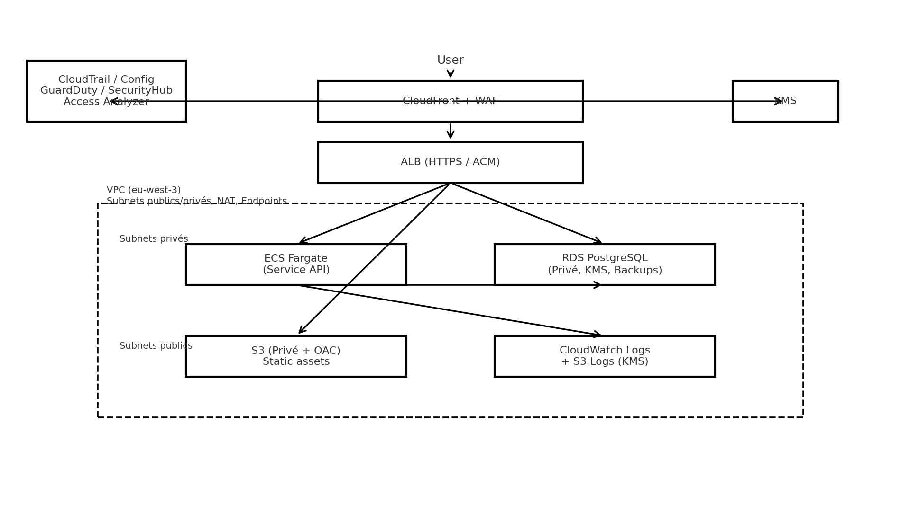
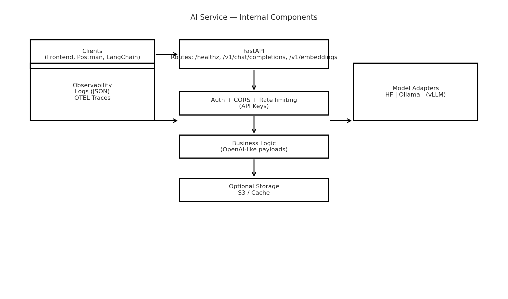
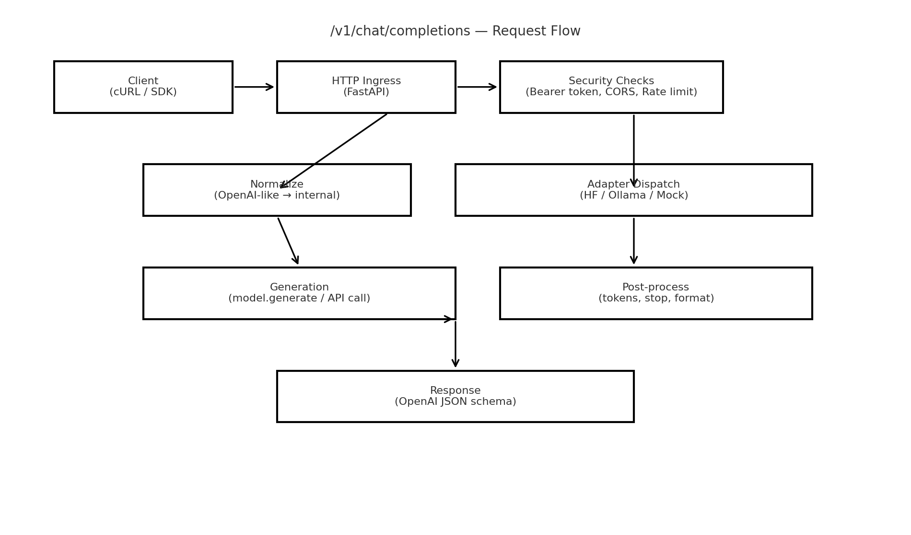

# 🤖 AI Service Boilerplate 2025 — by Wali


[](https://adaajr.github.io/ai-service-boilerplate/)

Ce projet est une **API IA prête pour la production**, que j’ai conçue comme un **point de départ** pour tout projet autour du **traitement du langage** (chatbots, assistants, embeddings…). Elle reprend les standards **OpenAI-like** (`/v1/chat/completions`, `/v1/embeddings`) pour être **compatible avec les clients existants** (langchain, openai-python, etc.).

---

## 📸 Aperçu (diagrammes)

### Architecture globale


### Composants internes


### Flux d’une requête chat


---

## 🔎 À quoi ça sert ?

- 🚀 Fournir une **API IA prête à l’emploi**, utilisable en local, sur serveur ou en cloud.
- 🔄 **Switcher facilement de backend** modèle (Hugging Face, Ollama, vLLM bientôt) sans changer vos clients.
- 🔐 Offrir une **base sécurisée** (auth API keys, CORS, rate limiting) pour déployer en interne ou en SaaS.
- 🧰 Servir de **boilerplate pédagogique** pour comprendre un service IA moderne (API, sécurité, CI).

### Exemples d’usages
- **Assistant interne** sur documents (embeddings + retrieval).
- **Recherche sémantique** (Pinecone, Weaviate, PGVector…).
- **Chatbot produit / support** (site web, Slack/Teams).
- **API perso** compatible outils OpenAI.

---

## ✨ Fonctionnalités

- Endpoints : `GET /healthz`, `POST /v1/chat/completions`, `POST /v1/embeddings`.
- Backends : **Hugging Face (CPU)**, **Ollama (local)**, **Mock** (tests) — vLLM en extension.
- Sécurité : **API keys** (`Authorization: Bearer ...`), **CORS**, rate limit simple.
- Observabilité : Logs **JSON**, **OpenTelemetry** (traces).
- Qualité : **ruff**, **mypy**, **pytest**.
- Supply chain : **SBOM** (Syft), scans **Trivy** (image) et **gitleaks** (secrets).
- Docker : image non-root, prête pour **ECR/ECS**.

---

## 🚀 Démarrer en local

```bash
python -m venv .venv && source .venv/bin/activate
pip install -r requirements.txt
uvicorn app.main:app --reload --port 8000
```

Test rapide :
```bash
curl -s http://localhost:8000/healthz
curl -s http://localhost:8000/v1/chat/completions   -H 'Content-Type: application/json'   -H 'Authorization: Bearer devkey'   -d '{"model":"hf:distilbert-base-uncased","messages":[{"role":"user","content":"Hello"}]}'
```

Docker :
```bash
docker build -t wali/ai-service:dev .
docker run -p 8000:8000 -e API_KEYS='["devkey"]' wali/ai-service:dev
```

---

## 🔐 Configuration (env)

- `API_KEYS` : liste JSON de clés API autorisées (ex: `["devkey"]`)
- `ALLOW_ORIGINS` : CORS (ex: `["*"]` pour dev, restreindre en prod)
- `MODEL_BACKEND` : `hf`, `ollama` ou `mock`
- `HF_MODEL_ID` : ex: `distilbert-base-uncased`
- `OLLAMA_HOST` : ex: `http://localhost:11434`

---

## 🧪 Qualité & CI

- **CI** : lint (ruff), mypy, tests (pytest), build Docker, SBOM (syft), scans (gitleaks, trivy).
- Badge CI : en haut du README (branche `dev`).

---

## 🗺️ Roadmap

- Backend **vLLM**, batching, file uploads, cache Redis, monitoring Prometheus, token limits, persistance S3.

---

✍️ **Auteur** : Wali Diabi — 2025
