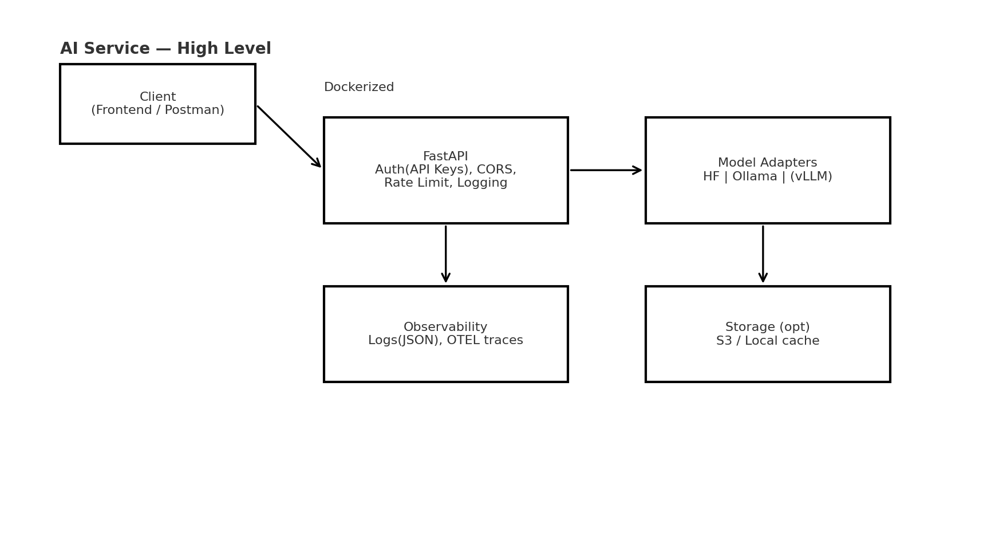

# 🤖 AI Service Boilerplate 2025 — by Wali

Ce dépôt est mon **boilerplate IA** prêt pour la prod : une **API FastAPI** compatible **OpenAI-like** (chat/embeddings), avec **Docker**, **tests**, **CI sécurité** (ruff, mypy, pytest, gitleaks, trivy), **SBOM** (Syft) et **CD** optionnel vers AWS (réutilisable avec mon infra).



## ✨ Fonctionnalités
- API **/healthz**, **/v1/chat/completions** (format OpenAI), **/v1/embeddings**.
- Adapteurs **modèles** : **Hugging Face Transformers** (CPU par défaut), **Ollama** (local), et point d’extension **vLLM**.
- **Rate limiting** & **API keys** (simple) + **CORS**.
- **Logs structurés** (JSON), **traces** OpenTelemetry (HTTP).
- **Tests** (pytest) & **type-checking** (mypy), **lint** (ruff).
- **Docker multi-étapes**; **SBOM** (Syft), scan **Trivy**, **gitleaks**.

## 🚀 Démarrer en local
```bash
python -m venv .venv && source .venv/bin/activate
pip install -r requirements.txt
uvicorn app.main:app --reload --port 8000
```

Test rapide :
```bash
curl -s http://localhost:8000/healthz
curl -s http://localhost:8000/v1/chat/completions -H 'Content-Type: application/json' -d '{"model":"hf:distilbert-base-uncased","messages":[{"role":"user","content":"Hello"}]}'
```

## 🧪 Qualité
```bash
ruff check .
mypy app
pytest -q
```

## 🛡️ CI/CD
- **CI** : lint (ruff), mypy, tests (pytest), SBOM (syft), scans (gitleaks, trivy), build Docker.
- **CD** : prêt à brancher sur ton infra AWS (ECR/ECS).

## 📦 Build Docker
```bash
docker build -t wali/ai-service:dev .
docker run -p 8000:8000 -e API_KEYS='["changeme"]' wali/ai-service:dev
```

## 🔐 Config sécurité (env)
- `API_KEYS` : liste JSON de clés API autorisées (ex: `["devkey"]`).
- `ALLOW_ORIGINS` : CORS (ex: `["*"]` pour dev, restreint en prod).
- `MODEL_BACKEND` : `hf`, `ollama` ou `mock`.
- `HF_MODEL_ID` : ex. `distilbert-base-uncased` (démo CPU).
- `OLLAMA_HOST` : ex. `http://localhost:11434`.

## 🧩 Routes
- `GET /healthz`
- `POST /v1/chat/completions` (OpenAI-like minimal)
- `POST /v1/embeddings`

## 🗺️ Roadmap
- vLLM backend, batching, queue SQS, cache Redis, monitoring Prometheus, limites de tokens, persistance S3.

---
Made by **Wali Diabi** — 2025
